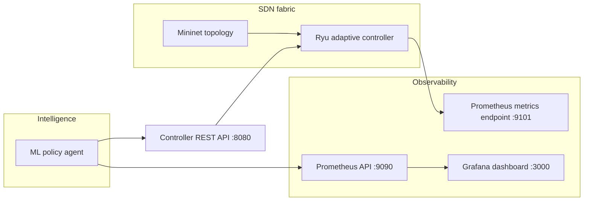

# An SDN-Based Adaptive Cloud Network Management Framework with Monitoring, Visualization, and ML-Based Optimization

This project is a complete Ubuntu-oriented implementation of an SDN-enabled adaptive cloud network management framework that combines:

- **Mininet** for emulated cloud topologies
- **Ryu** as the SDN controller
- **Prometheus** for metrics scraping
- **Grafana** for dashboards and visualization
- **scikit-learn** for anomaly classification and SLA-risk prediction
- **An adaptive policy loop** that blocks suspicious sources and reroutes congested flows in real time

The bundle is organized so you can deploy it inside an Ubuntu VM and demonstrate the full feedback loop:

1. the controller exports network and controller telemetry,
2. Prometheus stores the telemetry,
3. Grafana visualizes it,
4. the ML policy agent queries live metrics from Prometheus,
5. the agent pushes adaptive SDN policies back to the controller.

## Core capabilities

- Real-time SDN telemetry export from the controller
- Live Grafana dashboard for traffic, controller health, and ML predictions
- Synthetic dataset generation for SDN anomaly and congestion scenarios
- ML models for:
  - **traffic-state classification** (`normal`, `congestion`, `ddos`, `port_scan`)
  - **SLA risk scoring**
- Controller REST API for:
  - state inspection,
  - mitigation listing,
  - adaptive policy enforcement
- Automatic policy actions:
  - **block** suspicious source IPs,
  - **reroute** high-volume flows over an alternate SDN path,
  - **clear** expired mitigations

## Repository structure

```text
sdn_adaptive_cloud/
├── controller/
│   └── adaptive_controller.py
├── topology/
│   └── adaptive_cloud_topology.py
├── ml/
│   ├── common.py
│   ├── data_generator.py
│   ├── train_models.py
│   └── policy_agent.py
├── monitoring/
│   ├── prometheus/
│   │   ├── prometheus.yml
│   │   └── alerts.yml
│   └── grafana/
│       ├── dashboards/
│       └── provisioning/
├── scripts/
│   ├── install_ubuntu.sh
│   ├── start_all.sh
│   ├── stop_all.sh
│   ├── start_controller.sh
│   ├── start_policy_agent.sh
│   ├── start_observability.sh
│   ├── run_topology.sh
│   └── clean_mininet.sh
├── docs/
│   ├── ARCHITECTURE.md
│   ├── DEPLOYMENT_GUIDE.md
│   ├── EVALUATION.md
│   └── PYCHARM_LINUX_GIT_SETUP.md
├── data/
│   └── README.md
├── tests/
│   ├── test_ml_pipeline.py
│   └── test_policy_logic.py
├── docker-compose.yml
├── requirements.txt
└── Makefile
```

## Architecture



## Recommended runtime

- Ubuntu 22.04 LTS is the safest target for the full Ryu + Mininet stack.
- Ubuntu 24.04 can still be used, but Python 3.10/3.11 is preferred when available for smoother Ryu installation.

## Quick start

For a local IDE + Ubuntu VM workflow, see `docs/PYCHARM_LINUX_GIT_SETUP.md`.

### 1) Install dependencies

```bash
cd sdn_adaptive_cloud
bash scripts/install_ubuntu.sh
```

### 2) Start the stack

```bash
bash scripts/start_all.sh
```

This starts:

- Prometheus on `http://localhost:9090`
- Grafana on `http://localhost:3000` (`admin` / `admin`)
- Ryu controller on OpenFlow port `6653`
- Controller REST API on `http://localhost:8080`
- ML policy agent metrics on `http://localhost:9102/metrics`

### 3) Run the topology interactively

```bash
bash scripts/run_topology.sh --foreground --scenario mixed --cli
```

### 4) Inspect state

```bash
curl -s http://127.0.0.1:8080/api/v1/state | jq
curl -s http://127.0.0.1:8080/api/v1/mitigations | jq
```

## Demo scenarios

The Mininet topology script supports:

- `idle`
- `normal`
- `congestion`
- `ddos`
- `port_scan`
- `mixed`

Examples:

```bash
bash scripts/run_topology.sh --foreground --scenario normal
bash scripts/run_topology.sh --foreground --scenario congestion
bash scripts/run_topology.sh --foreground --scenario ddos
bash scripts/run_topology.sh --foreground --scenario mixed
```

## Adaptive actions

The ML agent translates live metrics into controller actions:

- `normal`: observe only
- `congestion`: reroute the top talker flow onto an alternate path
- `ddos` / `port_scan`: block the highest-risk source IP
- low risk after recovery: clear expired mitigations

## Manual controller actions

### Block an IP

```bash
curl -X POST http://127.0.0.1:8080/api/v1/policy/enforce \
  -H 'Content-Type: application/json' \
  -d '{"type":"block","src_ip":"10.0.0.3","duration":90,"reason":"manual block"}'
```

### Reroute a flow

```bash
curl -X POST http://127.0.0.1:8080/api/v1/policy/enforce \
  -H 'Content-Type: application/json' \
  -d '{"type":"reroute","src_ip":"10.0.0.1","dst_ip":"10.0.0.4","duration":90,"reason":"congestion mitigation"}'
```

### Clear a mitigation

```bash
curl -X POST http://127.0.0.1:8080/api/v1/policy/enforce \
  -H 'Content-Type: application/json' \
  -d '{"type":"clear","src_ip":"10.0.0.3"}'
```

## Research mapping

This implementation directly maps to your proposal:

- **Monitoring layer**: controller metrics exported to Prometheus
- **Visualization layer**: provisioned Grafana dashboard
- **ML layer**: predictive classification + SLA-risk model
- **Adaptive SDN enforcement**: policy loop posts changes to the Ryu controller
- **Evaluation**: compare baseline (without policy agent) vs adaptive mode

## Notes

- The install script creates a **virtual environment with system site packages** so Mininet remains accessible while Python dependencies are isolated.
- The policy engine is written to prefer Prometheus as the telemetry source, with controller-state fallback for resilience.
- The topology includes **parallel switch paths** so congestion mitigation can demonstrate real rerouting rather than only traffic drops.

## Suggested experiment workflow

1. Start the system with the policy agent disabled.
2. Run `congestion` and `ddos` scenarios and record:
   - packet rate,
   - byte rate,
   - link utilization,
   - mitigation latency,
   - SLA risk.
3. Enable the policy agent.
4. Re-run the same scenarios.
5. Compare:
   - time to mitigation,
   - peak utilization,
   - number of persistent anomalies,
   - recovery time.

See `docs/EVALUATION.md` for a ready-to-use baseline vs adaptive test procedure.
